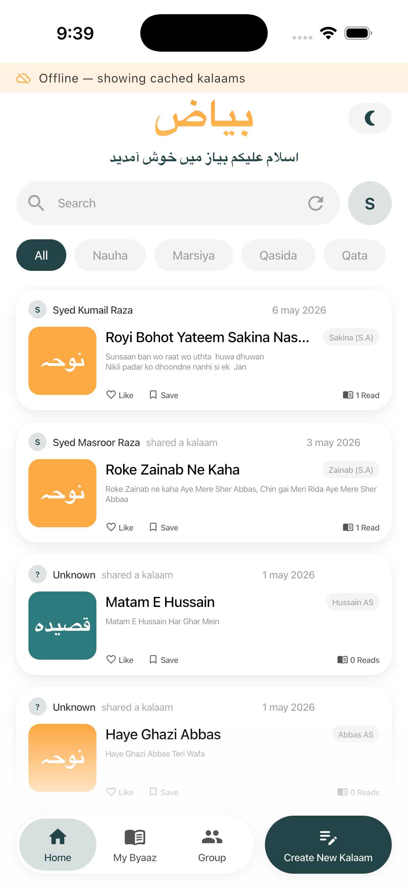
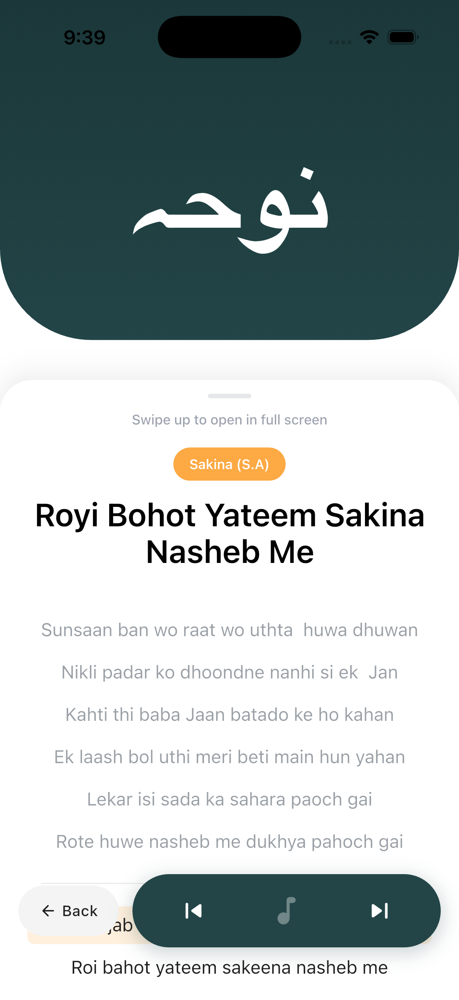
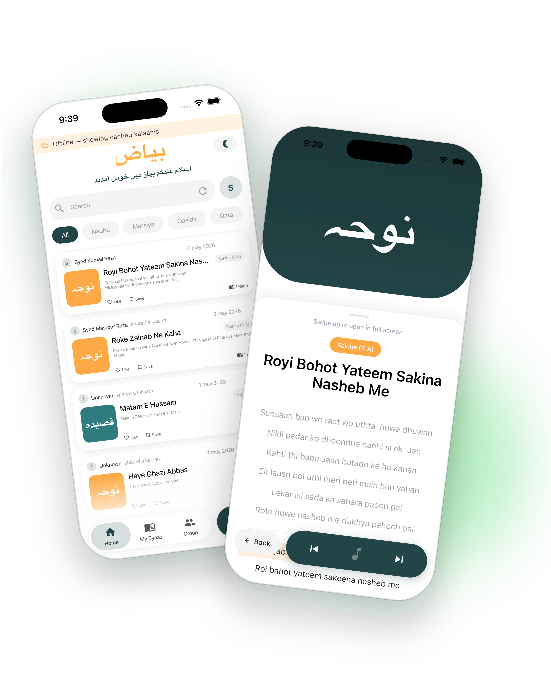

# BAYAAZ

> The poetry bayaaz you remember — a modern, offline-first home for Urdu kalaams, marsiyas, and qasidas.

BAYAAZ helps zakireen, poets, and listeners organize, recite, score, and sync poetry across devices. The mobile app is built around three real-world workflows — keeping a personal kalaam library, practicing with real-time scoring, and running synchronized majlis sessions where every reciter follows the same line.

---

## Screenshots

| Home — your library | Recite — distraction-free | Showcase |
| :--: | :--: | :--: |
|  |  |  |

---

## Repository layout

```
Bayaaz/
├── client/            Flutter app (iOS + Android)
├── server/            Node.js + Express + Socket.io API
├── whisper-service/   Vosk WebSocket bridge for streaming STT
└── landing/           Next.js marketing site (home, privacy, terms)
```

Each subproject has its own README with deeper detail.

---

## Architecture at a glance

```
┌───────────────┐    WebSocket (PCM audio)    ┌────────────────────────┐
│  Flutter app  │ ─────────────────────────▶ │  Vosk WebSocket bridge │
│   (client/)   │                             │   (whisper-service/)   │
│               │ ◀────── partial / final ──  │                        │
└──────┬────────┘                             └────────────────────────┘
       │ REST + Socket.io
       ▼
┌─────────────────────────────┐    Mongoose    ┌────────────┐
│  Node.js API (server/)      │ ─────────────▶ │  MongoDB   │
│  - auth, kalaams, groups    │                └────────────┘
│  - practice analytics       │    Redis adapter
│  - majlis realtime sync     │ ─────────────▶ ┌────────────┐
└─────────────────────────────┘                │   Redis    │
                                               └────────────┘
```

- **Offline-first:** the Flutter app uses Isar for local cache. Every kalaam, like, view, and practice session is written locally first, then drained to the server when the network is back. Idempotency tokens prevent duplicate writes on retry.
- **Live recitation:** the Vosk bridge streams PCM from the device, returns transcribed lines, and a fuzzy matcher locks the active stanza. A Socket.io room (`session:<id>`) broadcasts the matched line so every reciter in a majlis stays in sync.
- **Auth:** JWT with Google sign-in support.

---

## Tech stack

| Layer | Tech |
| --- | --- |
| Mobile | Flutter, Provider, Isar, Socket.io client, `record`, `audioplayers` |
| API | Node.js, Express 5, Mongoose, Socket.io + Redis adapter, Multer |
| Realtime STT | Python, Vosk, websockets |
| Database | MongoDB |
| Cache / pub-sub | Redis |
| Marketing site | Next.js 16 (App Router), Tailwind v4, Geist + Noto Naskh Arabic |

---

## Quick start

### 1. Server (`server/`)

```bash
cd server
cp .env.example .env       # then fill MONGO_URI, JWT_SECRET, REDIS_URL, GOOGLE_CLIENT_ID
npm install
npm run dev                # http://localhost:4000
```

### 2. Whisper / Vosk service (`whisper-service/`)

```bash
cd whisper-service
python3 -m venv venv
source venv/bin/activate
pip install -r requirements.txt
# Download a Vosk model (e.g. vosk-model-small-hi-0.22) into ./vosk-model-*/
python vosk_service.py     # ws://localhost:2700
```

> The Phi-3 LLM weights (`Phi-3-mini-4k-instruct-q4.gguf`, ~2.2 GB) and the Vosk model directories are **not** committed — see [`.gitignore`](.gitignore). Download them locally.

### 3. Flutter client (`client/`)

```bash
cd client
flutter pub get
flutter run                # iOS simulator or Android emulator
```

Override the server URL at runtime via the in-app developer dialog (long-press the splash) if you aren't pointing at `localhost`.

### 4. Landing site (`landing/`)

```bash
cd landing
npm install
npm run dev                # http://localhost:3000
```

Pages: `/`, `/privacy`, `/terms`.

---

## Feature highlights

- **Offline-first library** — kalaams, likes, views, and practice scores all queue locally and drain on reconnect with idempotency tokens.
- **Real-time majlis sync** — Socket.io rooms keep every reciter on the same line; voice-driven line tracking via Vosk.
- **Practice mode with scoring** — per-line accuracy, flow, and pause scores, streaks, and weak-line tracking persisted in Isar and synced to the server.
- **Reference media** — attach MP3/MP4/WAV per kalaam, uploaded via multipart and served from `server/uploads/`.
- **Bilingual rendering** — Urdu (Naskh) and Roman transliteration side-by-side.
- **Group & deep-link invites** — share a kalaam or join a majlis via a one-tap link.

---

## Release process (mobile app)

The Flutter app is wired for store release. You provide the signing
material; the build pipeline does the rest.

### One-time setup

```bash
# Generate an upload keystore (Android)
keytool -genkey -v -keystore ~/bayaaz-upload.jks \
  -keyalg RSA -keysize 2048 -validity 10000 -alias bayaaz

# Tell Gradle where to find it
cp client/android/key.properties.example client/android/key.properties
# then edit client/android/key.properties with your storePassword,
# keyPassword, keyAlias=bayaaz, and absolute storeFile path
```

`client/android/key.properties` and `*.jks` are git-ignored.

### Building

```bash
cd client

# Android — release AAB for Play Console
flutter build appbundle --release \
  --dart-define=BASE_URL=https://api.your-prod-host.example

# Android — release APK for direct install / testing
flutter build apk --release \
  --dart-define=BASE_URL=https://api.your-prod-host.example

# iOS — release IPA (requires a valid signing identity in Xcode)
flutter build ipa --release \
  --dart-define=BASE_URL=https://api.your-prod-host.example
```

If `--dart-define=BASE_URL=...` is omitted, the app falls back to the
compile-time default in `lib/config/app_config.dart`. Override at
runtime from the in-app developer dialog.

### What's pre-wired for release

- **Android signing** — `key.properties` pattern (falls back to debug
  keystore when absent so dev keeps working).
- **Android network security** — release builds reject cleartext HTTP
  except for explicit dev hosts (`localhost`, `10.0.2.2`, LAN IPs).
  See `client/android/app/src/main/res/xml/network_security_config.xml`.
- **iOS encryption export** — `ITSAppUsesNonExemptEncryption=false` is
  declared, so TestFlight uploads don't block on the encryption
  questionnaire.
- **iOS permissions** — microphone and speech recognition usage strings
  are set in `Info.plist`.
- **Deep links** — `bayaaz://i/<token>` scheme registered on both
  platforms for invite redemption.
- **Offline-first** — every kalaam, like, view, and practice session is
  written locally first and drained on reconnect with idempotency
  tokens.

### Versioning (beta → stable)

```yaml
# client/pubspec.yaml
version: 1.0.0-beta.1+1   # current — pre-release
# Each invite wave / store upload:
#   - bump the build number (after `+`)              → 1.0.0-beta.1+2
#   - bump the beta number for each invite wave      → 1.0.0-beta.2+3
# When cutting the public launch, drop the suffix:
#   1.0.0+N
```

`kIsBeta` in `client/lib/config/app_config.dart` toggles the visible
"BETA · 1.0.0-beta.1" pill on the splash and home header. Flip to
`false` (and bump `kAppVersionLabel`) for the stable cut.

---

## Project status

Active. Beta access by request — write to **kumailappdev@gmail.com**.

---

## License

Proprietary, all rights reserved. Contact the maintainer before reuse.
